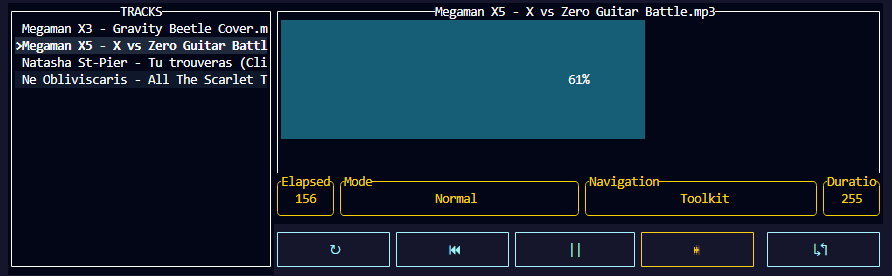

# Trackatui

A music player in the terminal using Ratatui and Rodio. Still work in progress. Feel free to contribute. 



## How to run.
1. First, clone the repository:

```bash
git clone https://github.com/oebelus/trackatui.git
```

2. Install Rust from this [link](https://rust-lang.org/tools/install/), or using the package manager of your choice.

3. And then, run the application using this command, passing the folder of your choice as an argument:

```bash
cargo run <folder-name>
```

## How to use. 
### Presentation
The application presents two vertical views:
- The music explorer: the left view.
- The currently playing track information: the right view, that presents from top to bottom:
    - Title of the current track, default track being the first one on the file explorer list. 
    - A progression gauge, that only updates when you use the application (currently, it's not a bug, it's a feature, until I fix it).
    - The song state and the application information bar:
        - Elapsed time (works the same as the progression gauge);
        - Current selected mode: Normal, Shuffle, Repeat;
        - Navigation state: Playlist and Toolkit (play, pause, forward ...etc.);
        - The total duration of the song. 
    - The toolkit, from left to right:
        - Toggle Repeat Mode;
        - Previous song;
        - Pause/Play current song;
        - Next song;
        - Toggle Shuffle Mode.

### Navigation
- To toggle between Playlist (or Explorer) mode and toolkit mode: **Tab**. 
- The Music is switched by pressing **top** and **down** arrows (or the corresponding vim bindings), selection is with **Enter**.
- The toolkit mode is navigated with the **left** and **right** arrows, selection is with **Enter** key as well. 